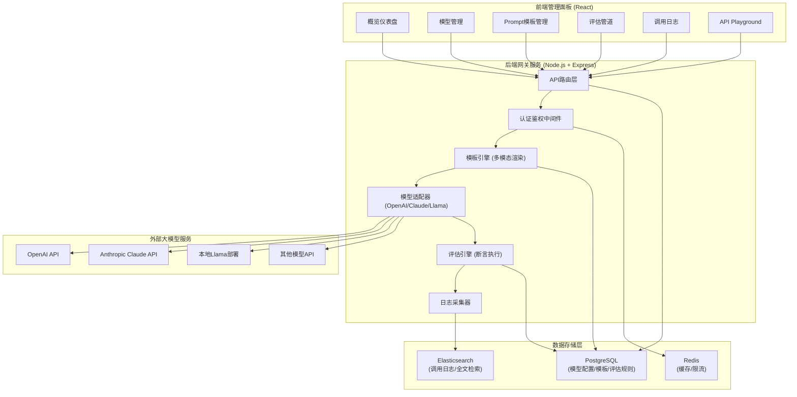
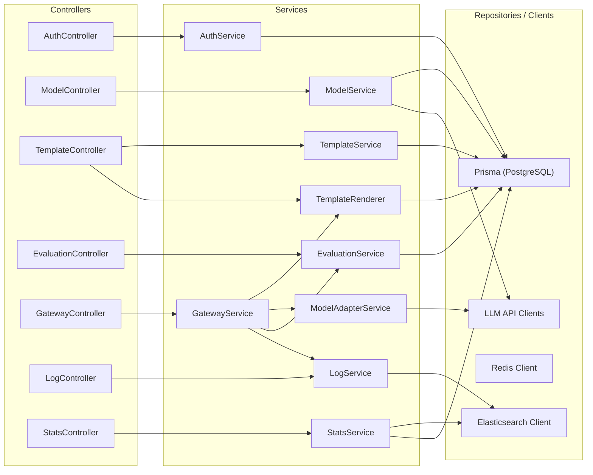
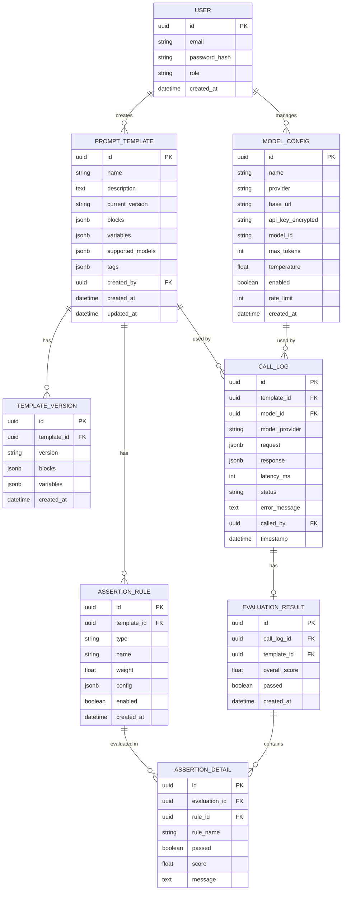

## 1. 架构设计



## 2. 技术选型说明

- **前端**：React@18 + TypeScript + Vite + TailwindCSS@3 + React Router@6 + Recharts（图表）
- **UI组件**：自研组件库 + Lucide React（图标）
- **后端**：Node.js + Express@4 + TypeScript
- **数据库**：PostgreSQL（主数据） + Prisma ORM
- **搜索引擎**：Elasticsearch 8.x（调用日志存储与检索）
- **缓存/限流**：Redis
- **认证**：JWT Token + BCrypt
- **模板引擎**：自研多模态模板渲染引擎
- **模型适配**：策略模式，统一抽象接口适配各厂商API
- **评估引擎**：可插拔断言规则插件体系

## 3. 前端路由定义

| 路由路径 | 页面用途 |
|----------|----------|
| `/dashboard` | 概览仪表盘 |
| `/models` | 模型管理列表 |
| `/models/new` | 新增模型配置 |
| `/models/:id/edit` | 编辑模型配置 |
| `/templates` | Prompt模板列表 |
| `/templates/new` | 新建Prompt模板 |
| `/templates/:id` | 模板编辑器（多模态编辑+预览） |
| `/templates/:id/versions` | 模板版本管理 |
| `/evaluations` | 评估管道列表 |
| `/evaluations/:templateId` | 评估规则编辑器 |
| `/evaluations/:templateId/report` | 评估报告 |
| `/logs` | 调用日志检索 |
| `/logs/:id` | 调用详情 |
| `/playground` | API Playground |

## 4. API定义

### 4.1 类型定义

```typescript
// 模型配置
interface ModelConfig {
  id: string;
  name: string;
  provider: 'openai' | 'claude' | 'llama' | 'other';
  baseUrl: string;
  apiKey: string;
  modelId: string;
  maxTokens: number;
  temperature: number;
  enabled: boolean;
  rateLimit: number;
  createdAt: string;
  updatedAt: string;
}

// 多模态内容块
type ModalityBlock =
  | { type: 'text'; content: string }
  | { type: 'image'; url: string; alt?: string }
  | { type: 'table'; headers: string[]; rows: string[][] }
  | { type: 'pdf_summary'; fileId: string; summary: string; pages?: number };

// Prompt模板
interface PromptTemplate {
  id: string;
  name: string;
  description: string;
  version: string;
  blocks: ModalityBlock[];
  variables: { name: string; type: 'string' | 'number' | 'image_url' | 'table_data'; required: boolean; defaultValue?: any }[];
  supportedModels: string[];
  tags: string[];
  createdBy: string;
  createdAt: string;
  updatedAt: string;
}

// 断言规则
type AssertionType = 'keyword_contains' | 'keyword_excludes' | 'json_schema' | 'regex_match' | 'sentiment' | 'custom_script';

interface AssertionRule {
  id: string;
  templateId: string;
  type: AssertionType;
  name: string;
  weight: number;
  config: Record<string, any>;
  enabled: boolean;
}

// 评估结果
interface EvaluationResult {
  id: string;
  callLogId: string;
  templateId: string;
  overallScore: number;
  passed: boolean;
  assertions: {
    ruleId: string;
    name: string;
    passed: boolean;
    score: number;
    message?: string;
  }[];
  createdAt: string;
}

// 调用日志
interface CallLog {
  id: string;
  templateId?: string;
  modelId: string;
  modelProvider: string;
  request: {
    prompt: string;
    modalities: string[];
    variables: Record<string, any>;
    params: Record<string, any>;
  };
  response: {
    content: string;
    usage: { promptTokens: number; completionTokens: number; totalTokens: number };
  };
  latencyMs: number;
  status: 'success' | 'error' | 'rate_limited';
  errorMessage?: string;
  evaluation?: EvaluationResult;
  calledBy: string;
  timestamp: string;
}
```

### 4.2 REST API端点

| 方法 | 路径 | 用途 |
|------|------|------|
| POST | `/api/auth/login` | 用户登录 |
| GET | `/api/models` | 获取模型列表 |
| POST | `/api/models` | 新增模型配置 |
| PUT | `/api/models/:id` | 更新模型配置 |
| DELETE | `/api/models/:id` | 删除模型 |
| POST | `/api/models/:id/health-check` | 模型健康检查 |
| GET | `/api/templates` | 获取模板列表（分页+搜索） |
| POST | `/api/templates` | 创建模板 |
| GET | `/api/templates/:id` | 获取模板详情 |
| PUT | `/api/templates/:id` | 更新模板 |
| DELETE | `/api/templates/:id` | 删除模板 |
| GET | `/api/templates/:id/versions` | 获取版本历史 |
| POST | `/api/templates/:id/render` | 预览模板渲染结果 |
| GET | `/api/templates/:id/assertions` | 获取评估规则 |
| POST | `/api/templates/:id/assertions` | 新增断言规则 |
| PUT | `/api/assertions/:id` | 更新断言规则 |
| DELETE | `/api/assertions/:id` | 删除断言规则 |
| POST | `/api/gateway/chat` | 网关统一调用接口（核心） |
| GET | `/api/logs` | 调用日志检索（ES） |
| GET | `/api/logs/:id` | 调用日志详情 |
| GET | `/api/stats/summary` | 仪表盘统计数据 |
| GET | `/api/stats/trends` | 趋势数据 |
| GET | `/api/evaluations/:templateId/report` | 评估报告 |

### 4.3 网关调用请求/响应示例

```typescript
// 请求
interface GatewayChatRequest {
  templateId?: string;
  modelId: string;
  variables?: Record<string, any>;
  modalities?: ModalityBlock[];
  stream?: boolean;
  params?: {
    temperature?: number;
    maxTokens?: number;
    topP?: number;
  };
  runEvaluation?: boolean;
}

// 响应
interface GatewayChatResponse {
  id: string;
  modelId: string;
  content: string;
  usage: { promptTokens: number; completionTokens: number; totalTokens: number };
  latencyMs: number;
  evaluation?: EvaluationResult;
}
```

## 5. 服务端分层架构



## 6. 数据模型

### 6.1 ER图



### 6.2 Elasticsearch索引Mapping

```json
{
  "call_logs": {
    "mappings": {
      "properties": {
        "id": { "type": "keyword" },
        "templateId": { "type": "keyword" },
        "templateName": { "type": "text" },
        "modelId": { "type": "keyword" },
        "modelProvider": { "type": "keyword" },
        "status": { "type": "keyword" },
        "latencyMs": { "type": "integer" },
        "tokens": {
          "properties": {
            "prompt": { "type": "integer" },
            "completion": { "type": "integer" },
            "total": { "type": "integer" }
          }
        },
        "evaluation": {
          "properties": {
            "passed": { "type": "boolean" },
            "overallScore": { "type": "float" }
          }
        },
        "calledBy": { "type": "keyword" },
        "timestamp": { "type": "date" },
        "requestContent": { "type": "text" },
        "responseContent": { "type": "text" }
      }
    }
  }
}
```

